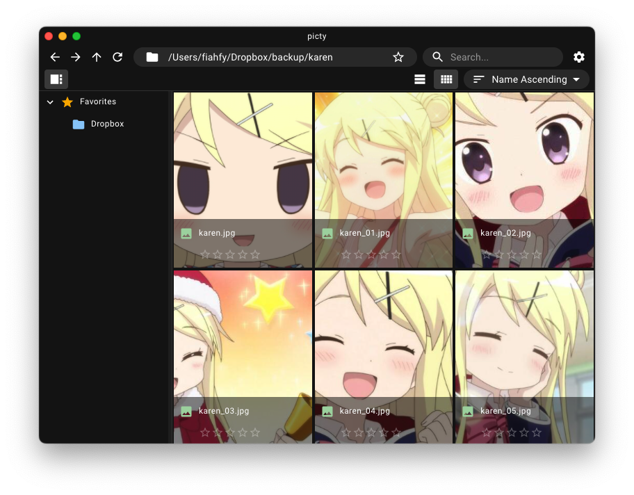

# Zephy


> Simple Media File Manager based on Electron.

## Features

- Favorites
- Rating
- Light/Dark mode
- Cross platform support

## TODOs

- [ ] Copy & Move Duplicated Item
- [ ] Sort Favorites
- [ ] Change Thumbnail Size
- [ ] Video Preview Thumbnails
- [ ] Folder Preview

## Screenshots




## Installation

Download the app from [release page](https://github.com/fiahfy/zephy/releases) and install it.  
:warning: For macOS, this app is not signed, so a warning will be displayed at startup.

## Development

```bash
# install dependencies
yarn

# serve with hot reload
yarn dev
```
