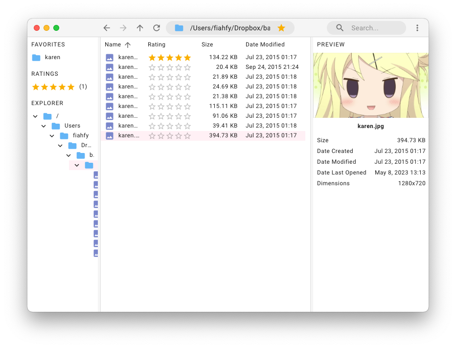

# Zephy

[](https://github.com/fiahfy/zephy/actions/workflows/create-release.yml)

> Simple File Browser based on Electron.

## Features

- Favorites
- Rating
- Text, Image and Video Preview
- Tree View Display
- Tabbed Browsing
- Dark Mode Support
- Cross-Platform Compatibility

## TODOs
 
- [ ] Show progress when copying & moving large files
- [ ] Sort & Rename Favorites
- [ ] Handle focus on favorites, ratings
- [ ] Change Thumbnail Size
- [ ] Use Electron Forge

## Screenshots



## Installation

Download the app from [release page](https://github.com/fiahfy/zephy/releases) and install it.  
:warning: For macOS, this app is not signed, so a warning will be displayed at startup.

## Development

```bash
# install dependencies
yarn

# serve with hot reload
yarn dev
```

## References

- https://github.com/electron-vite/create-electron-vite
- https://github.com/vitejs/vite/tree/main/packages/create-vite/template-react-ts
- https://github.com/mui/material-ui/tree/master/examples/material-ui-vite-ts
